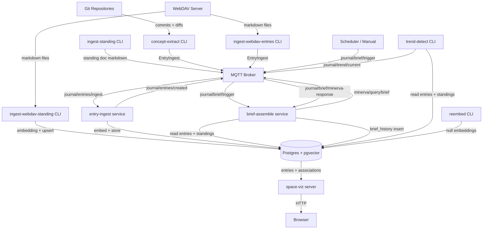
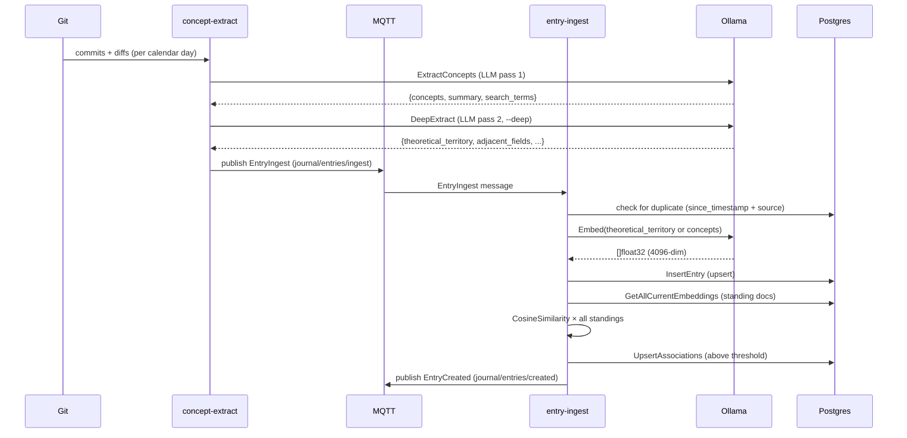
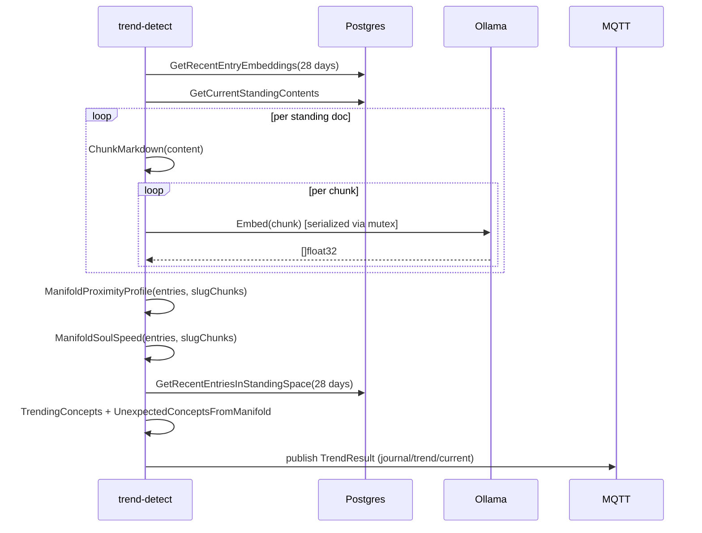
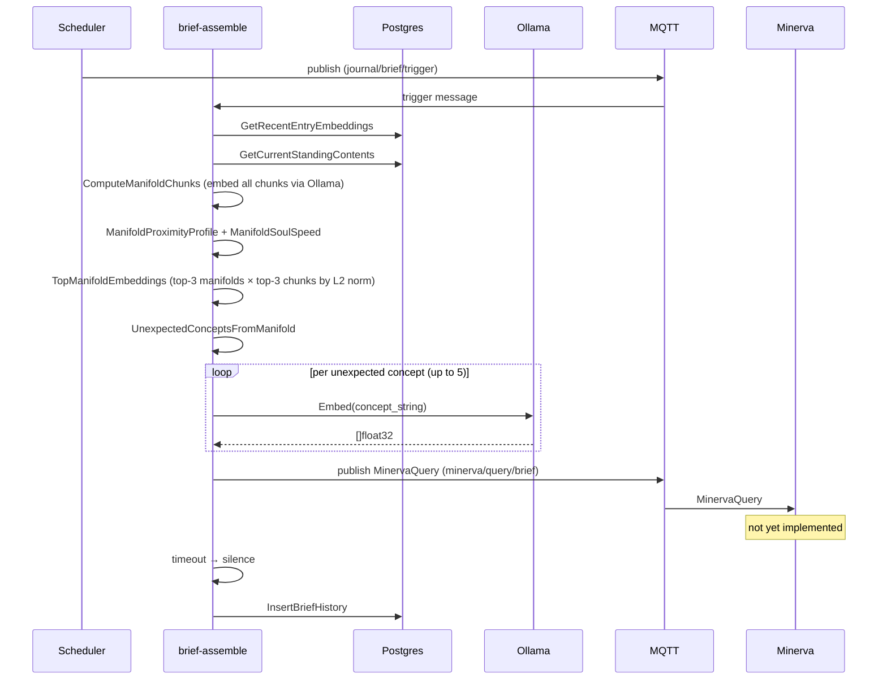
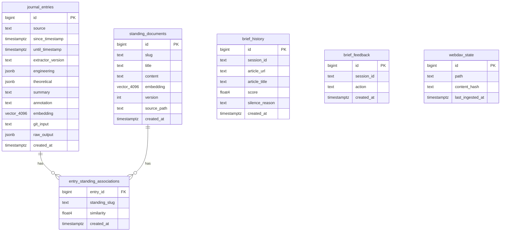

# Journal — Architecture

> _MQTT-native, Postgres-backed with pgvector, built in Go._

**As of**: March 2026

---

## Table of Contents

1. [System Overview](#1-system-overview)
2. [Component Inventory](#2-component-inventory)
3. [Data Flow](#3-data-flow)
4. [MQTT Topic Map](#4-mqtt-topic-map)
5. [Data Model](#5-data-model)
6. [Key Data Structures](#6-key-data-structures)
7. [Embedding Pipeline](#7-embedding-pipeline)
8. [Manifold Computation Pipeline](#8-manifold-computation-pipeline)
9. [Brief Assembly Pipeline](#9-brief-assembly-pipeline)
10. [Minerva Integration Protocol](#10-minerva-integration-protocol)
11. [Infrastructure and Deployment](#11-infrastructure-and-deployment)
12. [Invariants](#12-invariants)
13. [Known Constraints and Tradeoffs](#13-known-constraints-and-tradeoffs)

---

## 1. System Overview

Journal is a pipeline system that transforms engineering work (git commits) and freeform writing into a temporally-indexed, geometrically-organized semantic record of thought. It is designed around three architectural principles:

1. **MQTT-native**: all inter-component communication is via message broker. Components are decoupled — each can be replaced or extended independently.
2. **Postgres with pgvector**: all persistent state, including 4096-dimensional embedding vectors, lives in a single Postgres database.
3. **Ollama on host**: all embedding and LLM inference runs locally via Ollama, with no external API dependencies.



---

## 2. Component Inventory

### Long-Running Services

| Binary | Role | Trigger |
|--------|------|---------|
| `entry-ingest` | Receives entry payloads from MQTT, computes embeddings via Ollama, stores entries, computes standing associations, publishes creation events | MQTT subscription `journal/entries/ingest` |
| `brief-assemble` | On trigger: computes current trend, constructs Minerva query with embedding vectors, awaits response, records brief history | MQTT subscription `journal/brief/trigger` |
| `space-viz` | Serves interactive 3D visualization of entries in standing-doc space. Axes: UMAP-reduced (X/Z), time (Y), soul-speed (color) | HTTP server on port 8765 |

### CLI Tools

| Binary | Role | When Run |
|--------|------|----------|
| `concept-extract` | Two-pass LLM extraction of engineering concepts and theoretical territory from git commits. Publishes per-day `EntryIngest` messages | Daily cron or manual trigger |
| `trend-detect` | Computes manifold proximity profile and soul speed across recent entries, publishes `TrendResult` | Daily cron or manual trigger |
| `ingest-standing` | Ingest a single standing document from a local markdown file | On standing doc creation/update |
| `ingest-webdav-standing` | Fetch all standing documents from a WebDAV server, skip unchanged (content hash), embed and store | Scheduled or manual |
| `ingest-webdav-entries` | Fetch freeform markdown entries from WebDAV, parse date, run concept extraction, publish to MQTT | Scheduled or manual |
| `reembed` | Re-embed entries with null embeddings (recovery from Ollama downtime) | On-demand |
| `brief-feedback` | Record read/skip feedback for a brief session | Post-brief |

---

## 3. Data Flow

### Entry Lifecycle



### Trend Detection



### Brief Assembly



---

## 4. MQTT Topic Map

| Topic | Direction | Producer | Consumer | Message Type |
|-------|-----------|----------|----------|--------------|
| `journal/entries/ingest` | inward | `concept-extract`, `ingest-webdav-entries` | `entry-ingest` | `EntryIngest` |
| `journal/entries/created` | outward | `entry-ingest` | external consumers | `EntryCreated` |
| `journal/trend/current` | outward | `trend-detect` | external consumers | `TrendResult` |
| `journal/brief/trigger` | inward | scheduler, manual | `brief-assemble` | `BriefTrigger` |
| `minerva/query/brief` | outward | `brief-assemble` | Minerva | `MinervaQuery` |
| `journal/brief/minerva-response` | inward | Minerva | `brief-assemble` | `MinervaResponse` |

All messages are JSON-encoded with an `Envelope` header containing `message_id`, `source`, and `timestamp`.

---

## 5. Data Model

### Schema Overview



### Key Constraints

- `journal_entries`: unique on `(source, since_timestamp) WHERE since_timestamp IS NOT NULL` — enforces one entry per repo per calendar day. Partial index; predicate must match exactly in `ON CONFLICT` clauses.
- `standing_documents`: unique on `(slug, version)` — allows versioned history per slug.
- `entry_standing_associations`: composite primary key `(entry_id, standing_slug)`.

### Migrations

Auto-run on service startup from `internal/database/migrations/`. Files are numbered sequentially (`001_*.sql`, `002_*.sql`, ...). Do not rename or reorder.

---

## 6. Key Data Structures

### EntryIngest (MQTT wire format, inbound)

```go
type EntryIngest struct {
    Envelope
    Source           string          // repository name
    SinceTimestamp   time.Time       // calendar day start (UTC midnight)
    UntilTimestamp   time.Time       // calendar day end (UTC 23:59:59)
    ExtractorVersion string          // "0.3.0"
    Engineering      json.RawMessage // {concepts, summary, search_terms}
    Theoretical      json.RawMessage // {theoretical_territory, adjacent_fields, arxiv_search_terms, research_questions}
    GitInput         string          // raw commit messages + diffs passed to LLM
}
```

### TrendResult (MQTT wire format, outbound)

```go
type TrendResult struct {
    Envelope
    ManifoldProfile    map[string]float32 // slug → GLF+soul-speed-weighted mean proximity [0,1]
    SoulSpeed          float32            // GLF-weighted mean proximity to soul-speed manifold [0,1]
    TrendingConcepts   []string           // top 7 by GLF-weighted frequency
    UnexpectedConcepts []string           // top 5 from entries distant from all manifolds
    EntryCount         int
    WindowDays         int
    ComputedAt         time.Time
    HumanSummary       string
}
```

### MinervaQuery (MQTT wire format, outbound to Minerva)

```go
type MinervaQuery struct {
    SessionID            string             // hex(UnixNano), echoed back in response
    ManifoldProfile      map[string]float32 // slug → proximity (informational)
    TrendEmbeddings      [][]float32        // up to 9 vectors: top-3 manifolds × top-3 chunks by L2 norm
    UnexpectedEmbeddings [][]float32        // up to 5 vectors: embedded unexpected concept strings
    SoulSpeed            float32
    TopK                 int                // always 5
    ResponseTopic        string             // "journal/brief/minerva-response"
}
```

`TrendEmbeddings` and `UnexpectedEmbeddings` carry `omitempty` — absent when Ollama is unavailable. Minerva must handle their absence gracefully.

### ManifoldEntryPoint (internal, for proximity computation)

```go
type ManifoldEntryPoint struct {
    EntryID        int64
    SinceTimestamp time.Time
    Embedding      pgvector.Vector  // 4096-dim
    Concepts       []string
}
```

### SlugChunks (internal, computed per trend run)

```go
type SlugChunks struct {
    Slug   string
    Chunks [][]float32  // per-chunk embeddings; not persisted
}
```

---

## 7. Embedding Pipeline

### Embedding Text Construction

For journal entries, the text embedded is constructed preferentially from `theoretical_territory` (Pass 2 output) when available, falling back to `concepts` (Pass 1 output). The summary is appended in both cases. This ensures the embedding represents theoretical content rather than surface engineering vocabulary.

### Ollama API

- **Endpoint**: `POST /api/embed`
- **Request**: `{"model": "qwen3-embedding:8b", "input": "<text>"}`
- **Response**: `{"embeddings": [[float32 × 4096]]}`
- **Serialization**: All embedding calls in long-running services are serialized via `sync.Mutex`. Concurrent requests to Ollama time out.

### Reembedding

`reembed` queries for entries with `embedding IS NULL` and processes them sequentially. Used for recovery when Ollama was unavailable at ingest time.

---

## 8. Manifold Computation Pipeline

### ChunkMarkdown

```
Input:  markdown string
Output: []string (semantic chunks)

Algorithm:
1. Split on "\n\n" (paragraph boundaries)
2. Merge fragments < 50 chars into next chunk (absorbs headings)
3. Split chunks > 2000 chars on "\n"
```

### ComputeManifoldChunks

For each standing document:
1. `ChunkMarkdown(content)` → `[]string`
2. For each chunk: `Ollama.Embed(chunk)` → `[]float32` (serialized via mutex)
3. Returns `[]SlugChunks`

### NearestChunkDistance

```
distance(entry_emb, chunks) = 1 − max{ CosineSimilarity(entry_emb, c) | c ∈ chunks }
```

Returns 1.0 if `chunks` is empty.

### ManifoldProximityProfile

```
For each lateral manifold m (slug ≠ "soul-speed"):
    For each entry e:
        glfW  = 1 / (1 + exp(0.3 × (age_days(e) − 14)))
        ssW   = 1 − NearestChunkDistance(e.embedding, soul_speed_chunks)
        w     = glfW × (0.5 + 0.5 × ssW)
        prox  = 1 − NearestChunkDistance(e.embedding, m.chunks)
        weightedSum[m] += prox × w
        totalWeight[m] += w
    profile[m] = weightedSum[m] / totalWeight[m]
```

### ManifoldSoulSpeed

```
For soul-speed manifold only:
    For each entry e:
        w    = GLF(age_days(e))   [no soul-speed modifier — would be circular]
        prox = 1 − NearestChunkDistance(e.embedding, soul_speed_chunks)
        weightedSum += prox × w
        totalWeight += w
    soul_speed = weightedSum / totalWeight
```

Note: soul-speed is computed without soul-speed modification (it uses plain GLF weighting) to avoid circular dependency.

### TopManifoldEmbeddings

```
1. Sort manifolds by profile score descending
2. Take top-N manifolds (default 3)
3. For each: sort chunks by L2 norm descending, take top-K (default 3)
4. Return flat [][]float32
```

L2 norm is used as a proxy for semantic density — higher-norm vectors in embedding space tend to carry more specific, less generic content.

---

## 9. Brief Assembly Pipeline

### Trigger to Query

On receipt of `journal/brief/trigger`:

1. Fetch recent entries with embeddings: `GetRecentEntryEmbeddings(28 days)`
2. Fetch standing doc contents: `GetCurrentStandingContents`
3. Compute manifold chunks: `ComputeManifoldChunks` (Ollama, serialized)
4. Compute profile: `ManifoldProximityProfile`
5. Compute soul speed: `ManifoldSoulSpeed`
6. Extract top embedding vectors: `TopManifoldEmbeddings(profile, chunks, topN=3, chunksPerManifold=3)`
7. Extract unexpected concepts: `UnexpectedConceptsFromManifold(topN=5)`
8. Embed each concept string via Ollama
9. Publish `MinervaQuery` to `minerva/query/brief`
10. Await response on `journal/brief/minerva-response` for up to 30 seconds

### Session Tracking

Each trigger generates a session ID (`hex(UnixNano)`). This ID is echoed in the Minerva response and used to match the response to the waiting handler. Responses with mismatched session IDs are discarded.

### Silence Logic

Brief produces silence (no article surfaced) when:
- Minerva response timeout fires (30 seconds, configurable)
- Response `score` < `BRIEF_RELEVANCE_THRESHOLD` (default 0.6)
- Minerva responds with `score: 0.0` (no candidates)

Silence is a valid outcome and is recorded in `brief_history`.

### Environment Variables

| Variable | Default | Description |
|----------|---------|-------------|
| `BRIEF_RELEVANCE_THRESHOLD` | `0.6` | Minimum Minerva score to surface an article |
| `BRIEF_TREND_MANIFOLDS` | `3` | Number of top manifolds to extract vectors from |
| `BRIEF_TREND_CHUNKS` | `3` | Chunks per manifold (by L2 norm) |
| `BRIEF_UNEXPECTED_VECTORS` | `5` | Number of unexpected concept embeddings |
| `BRIEF_TIMEOUT` | `30s` | Minerva response timeout |

---

## 10. Minerva Integration Protocol

Minerva is an external system responsible for article recommendation. Journal defines one side of the protocol; the Minerva side is not yet implemented. Until it is, `brief-assemble` will produce silence on every run — this is expected behavior, not a bug.

### Query (Journal → Minerva)

**Topic**: `minerva/query/brief`

```json
{
  "session_id": "189e5c5163294ec0",
  "manifold_profile": {
    "universe-design": 0.647,
    "gradient-lossy-functions": 0.634,
    "distributed-patterns": 0.521
  },
  "trend_embeddings": [[...4096 floats...], [...], ...],
  "unexpected_embeddings": [[...4096 floats...], ...],
  "soul_speed": 0.58,
  "top_k": 5,
  "response_topic": "journal/brief/minerva-response"
}
```

`trend_embeddings` and `unexpected_embeddings` may be absent (`omitempty`) if Ollama was unavailable. `manifold_profile` is always present.

### Response (Minerva → Journal)

**Topic**: `journal/brief/minerva-response`

```json
{
  "session_id": "189e5c5163294ec0",
  "article_url": "https://arxiv.org/abs/...",
  "article_title": "...",
  "score": 0.72
}
```

`session_id` must echo exactly. If no candidates: `score: 0.0` (do not let timeout fire).

### Minerva's Responsibilities

- Maintain an article corpus with embeddings in the same 4096-dimensional space (qwen3-embedding:8b)
- Accept `trend_embeddings` for ANN retrieval against the corpus
- Accept `unexpected_embeddings` for frontier retrieval
- Use `soul_speed` to modulate recommendation strategy (novel vs. consolidating)
- Use `manifold_profile` for interpretable filtering if needed
- Return highest-scoring candidate with its score

---

## 11. Infrastructure and Deployment

### Local Development

| Service | Port | Note |
|---------|------|------|
| Postgres | 5433 | Offset from 5432 to avoid conflicts with Minerva |
| Mosquitto | 1884 | Offset from 1883 |
| Ollama | 11434 | Standard; runs on host, not in Docker |
| space-viz | 8765 | Reserved; do not reuse |

```bash
make infra          # Start Postgres + Mosquitto via Docker Compose
make build-primitives  # Build all binaries to ./build/
make test           # go test ./...
```

### Production (Nomad)

- **Nomad**: `http://nomad.service:4646`
- **Vault**: `https://vault.service:8200`
- **Artifact server**: `http://artifacts.service:8080/api/binaries/journal/<arch>/<binary>`
- **DC**: `data-center` (GPU nodes excluded)
- **Secrets**: `vault kv get ...`

Job definitions: `deploy/nomad/`

### External Dependencies

- **Ollama** (local): LLM inference and embedding. Must be running on host. The `qwen3-embedding:8b` model must be pulled.
- **WebDAV server** (optional): Nextcloud or similar for standing document and freeform entry ingestion. Configured via `WEBDAV_*` environment variables.
- **Minerva** (external system): Article recommendation system. Implements `minerva/query/brief` topic. Not part of this repository.

---

## 12. Invariants

The following invariants are maintained by the system and must be preserved:

1. **Standing slug stability**: A slug uniquely identifies a conceptual territory. Renaming a standing document creates a new territory. All historical associations, proximity scores, and gravity profiles for the old slug remain valid for the old territory only.

2. **Embedding dimension**: All entry and standing document embeddings are 4096-dimensional (qwen3-embedding:8b). Changing the embedding model requires migrating all vector columns and recomputing all embeddings.

3. **Entry per-day uniqueness**: One entry per calendar day per repository (`source + since_timestamp` partial unique index). Re-extraction overwrites all fields except `annotation` and `created_at`.

4. **Annotation preservation**: `annotation` (user-written notes) is excluded from the upsert `DO UPDATE SET` clause. Re-extraction never overwrites annotations.

5. **`created_at` reflects ingestion time**: `created_at` for entries reflects when the entry was first ingested, not when the commits were made. `since_timestamp` reflects the commit day.

6. **Soul-speed exclusion from lateral profile**: `SoulSpeedSlug = "soul-speed"` is filtered from the manifold proximity profile and from lateral slug lists everywhere. It is used only as a weight modifier.

7. **WebDAV state updated only after successful MQTT publish**: `UpsertWebDAVState` is called only after a successful `mqttClient.Publish`. Calling it earlier would mark a file as ingested even if the publish failed, causing it to be silently skipped on the next run.

8. **Migrations auto-run and are sequential**: Migration files in `internal/database/migrations/` must be numbered sequentially. They run automatically on service startup. Do not rename or reorder existing migration files.

---

## 13. Known Constraints and Tradeoffs

### Ollama Serialization

All embedding calls are serialized via `sync.Mutex`. This prevents concurrent Ollama requests, which time out. The consequence: embedding throughput is O(1) at a time, making large batch operations (e.g., reembedding the full corpus, or ingesting a standing document with many chunks) slow.

### Manifold Chunks Are Not Persisted

Chunk embeddings are recomputed on every trend detection and brief assembly run. For ~12 standing documents, this is a fixed cost of approximately `12 × avg_chunks × Ollama_embed_latency`. If standing documents grow significantly in number or length, this cost will increase linearly.

### Thresholds Require Calibration

Three thresholds are empirical starting points:
- `ASSOCIATION_THRESHOLD` (0.3): entry-to-standing cosine similarity floor
- `BRIEF_RELEVANCE_THRESHOLD` (0.6): Minerva score floor for article surfacing
- Soul Speed labels (0.45 / 0.55 / 0.65)

All three require calibration against a sufficiently large real corpus. The current values are reasonable starting points but not validated.

### GravityProfile Is a Legacy Computation

`GLFWeightedGravityProfile` and `GravityProfile` (the association-based gravity profile) are retained in the codebase but are no longer used for trend detection or brief assembly. Trend detection and brief assembly use `ManifoldProximityProfile`. The legacy functions remain for the `space-viz` visualization, which uses association-based coordinates. They may be removed when `space-viz` is updated to use manifold geometry.

### Partial Index Predicate Must Match Exactly

The unique constraint on `journal_entries` uses a partial index: `UNIQUE (source, since_timestamp) WHERE since_timestamp IS NOT NULL`. Any `ON CONFLICT` clause against this index must include the identical predicate wording. Postgres requires textual match.
